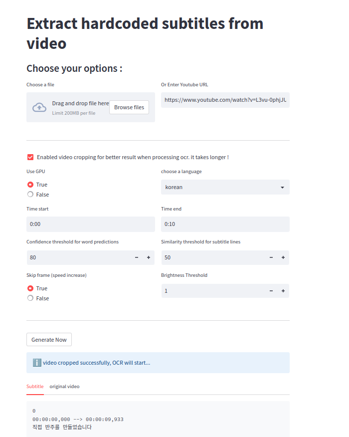

## Introduction

Extract Sub from Video for Streamlit : Extract hardcoded subtitles from videos and Youtube.

Using a Streamlit interface, Youtube video download + video cropping and subtitle extraction.

Program works with machine learning, multilingual OCR toolkits, ffmpeg, a flask server, docker...

##what technology and program used

- [PaddleOCR](https://github.com/PaddlePaddle/PaddleOCR/tree/release/2.6)  (PaddleOCR aims to create multilingual, awesome, leading, and practical OCR tools that help users train better models and apply them into practice.)
  - Paddle works on docker because it requires a specific version of Linux. But a flask API is developed to make it work. You just have to launch the docker command. See the explanations about the installation.
- [Videocr](https://github.com/oliverfei/videocr-PaddleOCR) Extract hardcoded (burned-in) subtitles from videos using the PaddleOCR OCR engine with Python
  - videocr is integrated in the flask api which is launched with the docker.
- [Streamlit](https://streamlit.io/) a graphical interface allows to manage all the process of file upload, Youtube video download as well as cropping and subtitle extraction.

##how to install it

**Note: you must have docker and python3.7 minimum installed on your machine**

```bash
sudo docker build -t your_name .
sudo docker run -p 5000:5000 --name your_name_container your_name
```

From there, you should have the api that handles OCR working well

```bash
cd app
pip install -r requirements.txt
streamlit run app_streamlit.py
```

**Note: modify pip by pip3 for example depending on what you have**

Streamlit server starts, you can start using the application and play with the settings.



## API

1. `filename`

    File name uploaded to the docker server, either a cropped video or an original video

2. `lang` 

    The language of the subtitles. (French, Chinese, English, Latin)

3. `gpu`

    if 1 the OCR process uses the GPU (it is more powerful and faster than the CPU.
  
4. `sim`
  
    Similarity threshold for subtitle lines.
  
5. `conf`
  
    Confidence threshold for word predictions. Words with lower confidence than this value will be discarded.

6.  `start_time` and `end_time`

    Extract subtitles from only a clip of the video. The subtitle timestamps are still calculated according to the full video length.
    

  